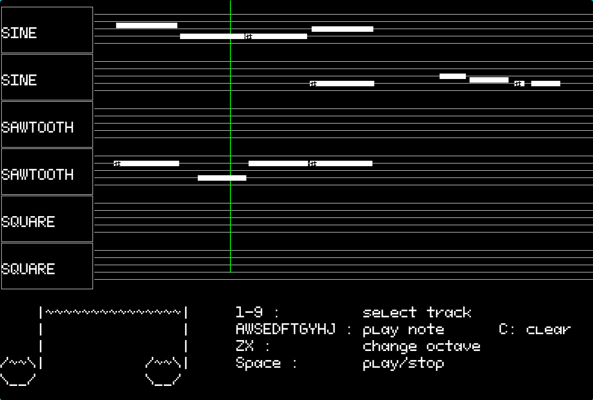

# Asm-Music

This is a 6-track sequencer with audio logic written in x86 Assembly, and UI part writtern in C++ (SFML)

# Requirements

OS  : Linux
CPU : Any with x86-64 instruction set and SIMD extention

Dependencies :
- cmake
- make
- clang/gcc 
- fasm
- PortAudio
- SFML 3

Running parsers is not required for compilation, but if you want, you need to have 
- python 
- numpy

# Build

`mkdir build && cd build && cmake .. && make`

# Sources 

Font : https://ggbot.itch.io/pixeloid-font

